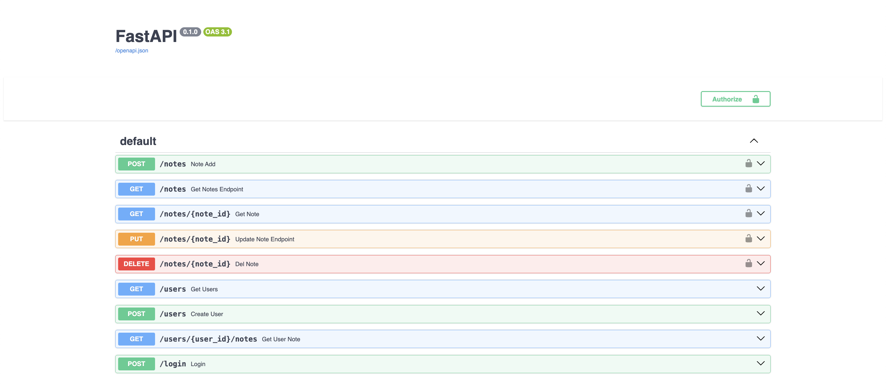

# FastAPI Notes Backend

Backend API для управления заметками с JWT-аутентификацией и разграничением доступа пользователей.

## Features

- FastAPI
- SQLAlchemy ORM
- JWT Authentication
- Password hashing (bcrypt)
- Ownership-based access control
- CRUD operations
- Dependency Injection
- Service Layer architecture
- Filtering and pagination
- Environment configuration via `.env`

## Tech Stack

- Python
- FastAPI
- PostgreSQL
- SQLAlchemy ORM
- JWT (python-jose)
- bcrypt

## Project Structure

```bash
notes-backend/
├── routers/
│   ├── notes.py
│   └── users.py
├── services/
│   └── note_service.py
├── .env.example
├── database.py
├── main.py
├── models.py
├── schemas.py
├── security.py
├── requirements.txt
└── README.md
```

## Environment Variables

Create `.env` file:

```env
DATABASE_URL=your_database_url
SECRET_KEY=your_secret_key
ALGORITHM=HS256
```

## API Endpoints

### Authentication

- `POST /users` — create user
- `POST /login` — get JWT token

### Notes

- `GET /notes` — get user notes
- `GET /notes/{note_id}` — get note by id
- `POST /notes` — create note
- `PUT /notes/{note_id}` — update note
- `DELETE /notes/{note_id}` — delete note

### Users

- `GET /users` — get users
- `GET /users/{user_id}/notes` — get user notes

## Swagger

Swagger UI documentation:


## Run Project

```bash
git clone https://github.com/KhayrullinTimur/notes-backend.git
cd notes-backend
pip install -r requirements.txt
uvicorn main:app --reload
```
